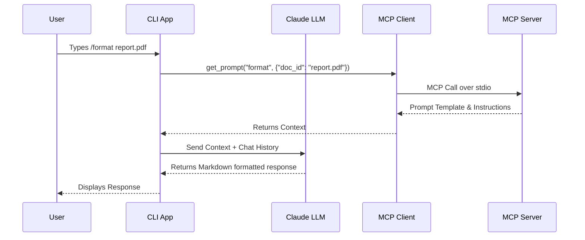

# MCP Chat 🚀

[](https://www.python.org/)
[](https://modelcontextprotocol.io/)

MCP Chat is a powerful, interactive command-line interface application that seamlessly integrates AI chat capabilities (powered by the Anthropic API) with extensive document management through the **Model Context Protocol (MCP)**. 

With MCP Chat, you can easily chat with Claude, retrieve context from local documents, execute predefined command-based prompts, and extend functionality via robust tool integrations.

---

## 🏗️ Architecture

The repository is structured to separate the frontend CLI, the language model orchestration, and the backend MCP server handling local resources.

```mermaid
flowchart TD
    User([User]) <-->|Chat and Commands| CLI[CliApp]
    
    subgraph Core System
        CLI <-->|Prompts| Claude[Claude API]
        CLI <-->|MCP Protocol| MCPClient[MCP Client]
    end
    
    subgraph MCP Backend
        MCPClient <-->|JSON-RPC| MCPServer[FastMCP Server]
        MCPServer <-->|Reads/Edits| Docs[(Document Store)]
    end
    
    classDef main fill:#2b313e,stroke:#4a5568,stroke-width:2px,color:#fff;
    classDef api fill:#0f3460,stroke:#1a1a2e,stroke-width:2px,color:#fff;
    classDef storage fill:#16213e,stroke:#0f3460,stroke-width:2px,color:#fff;
    
    CLI class:main
    MCPClient class:main
    MCPServer class:main
    Claude class:api
    Docs class:storage
```

### 🔄 Interaction Flow

Here is a sequence diagram illustrating what happens when a user requests a specific MCP command:



---

## 🛠️ Prerequisites

- **Python 3.9+**
- **Anthropic API Key**

---

## 🚀 Setup

### Step 1: Configure the Environment Variables

Create or edit the `.env` file in the project root and add your Anthropic API key:

```env
ANTHROPIC_API_KEY="sk-ant-..."  # Enter your Anthropic API secret key
CLAUDE_MODEL="claude-3-5-sonnet-20241022" # Or your preferred Claude model
# USE_UV="1" # Uncomment if using uv to run the mcp server
```

### Step 2: Install Dependencies

#### Option 1: Setup with `uv` (Recommended)

[uv](https://github.com/astral-sh/uv) is a blazing fast Python package installer and resolver.

1. **Install uv** (if not already installed):
   ```bash
   pip install uv
   ```
2. **Create and activate a virtual environment**:
   ```bash
   uv venv
   source .venv/bin/activate  # On Windows: .venv\Scripts\activate
   ```
3. **Install dependencies**:
   ```bash
   uv pip install -e .
   ```
4. **Run the project**:
   ```bash
   uv run main.py
   ```

#### Option 2: Setup without `uv` (Standard pip)

1. **Create and activate a virtual environment**:
   ```bash
   python -m venv .venv
   source .venv/bin/activate  # On Windows: .venv\Scripts\activate
   ```
2. **Install dependencies**:
   ```bash
   pip install anthropic python-dotenv prompt-toolkit "mcp[cli]==1.8.0"
   ```
3. **Run the project**:
   ```bash
   python main.py
   ```

---

## 💡 Usage

### Basic Interaction
Simply type your message in the terminal and press `Enter` to chat with the model.

### 📄 Document Retrieval (Resources)
The MCP server exposes local documents as resources. Use the `@` symbol followed by a document ID to inject its contents directly into your context:

```text
> Tell me about @deposition.md
```
*(Pro tip: Hit `Tab` after `@` to auto-complete available documents!)*

### ⚡ Commands (Prompts)
Use the `/` prefix to execute structured prompts defined within the MCP server:

```text
> /format deposition.md
```
*(Commands will also auto-complete when you press `Tab`.)*

---

## 🧑‍💻 Development

### Adding New Documents
The document store is currently virtualized in the server script. To add new documents, edit the `docs` dictionary in [`mcp_server.py`](mcp_server.py).

### Extending MCP Features
You can easily expand the capabilities of this repo by leveraging the `FastMCP` framework:
1. **Tools:** Add new `@mcp.tool()` functions in `mcp_server.py` to allow the LLM to take actions (e.g., editing files, searching the web).
2. **Resources:** Add new `@mcp.resource()` functions to expose local data.
3. **Prompts:** Add new `@mcp.prompt()` functions for templated LLM interactions.

### Linting and Typing
Currently, there are no strict linting or typing enforcement tools in place. Feel free to add `ruff`, `mypy`, or `pyright` to your workflow if desired.